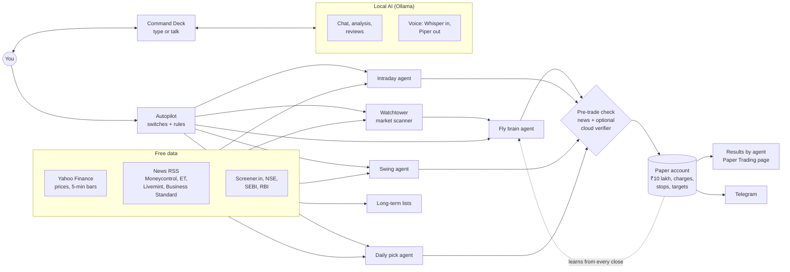

# Tradeo

   -green)  

**An open-source, local-first market assistant and paper-trading lab for Indian
investors** — NSE/BSE equities, ETFs, REITs, InvITs, bonds and gold.

Talk to it or type to it, let it scan the market, switch on trading agents
(intraday, swing, a daily pick, and an experimental reinforcement-learning
trader built on a fruit fly's brain wiring), and watch every trade they make on
a paper account — with each strategy's honest backtest shown next to its switch.

- **Runs on your laptop.** The AI is a local model through [Ollama](https://ollama.com);
  market data comes from free public sources. No account, key or broker needed.
- **Paper first.** Nothing touches real money unless you connect a broker *and*
  turn on three separate switches.
- **Everything starts OFF.** No background scanning or trading until you switch it
  on; heavy parts (AI model, voice) load only when used.
- **Honest numbers.** Every strategy shows its backtest after Indian charges,
  compared against random picks. Most have no proven edge yet — that's the point
  of testing on paper, and the invitation to contributors.
- **Open and pluggable.** Zerodha, Dhan, Angel One and Kotak Neo are built in;
  any other broker or strategy is one Python file.

> **Not financial advice.** Tradeo is a research and learning tool. Trade real
> money at your own risk.

---

## Contents

1. [Quick start](#quick-start)
2. [How it works](#how-it-works)
3. [A tour of the app](#a-tour-of-the-app)
4. [Your first 10 minutes](#your-first-10-minutes)
5. [Automation and trading agents](#automation-and-trading-agents)
6. [Strategies, and how they tested](#strategies-and-how-they-tested)
7. [Paper trading](#paper-trading)
8. [Long-term picks](#long-term-picks)
9. [The fly brain](#the-fly-brain)
10. [Voice](#voice)
11. [AI: local models and the optional cloud checker](#ai-local-models-and-the-optional-cloud-checker)
12. [Brokers](#brokers)
13. [Data sources and sentiment](#data-sources-and-sentiment)
14. [Telegram alerts](#telegram-alerts)
15. [Configuration](#configuration)
16. [Install in detail](#install-in-detail)
17. [Performance on small laptops](#performance-on-small-laptops)
18. [Project layout](#project-layout)
19. [Libraries used](#libraries-used)
20. [Testing and CI](#testing-and-ci)
21. [Project status](#project-status)
22. [Contributing and ideas](#contributing-and-ideas)
23. [Troubleshooting](#troubleshooting)
24. [Security](#security)
25. [License and credits](#license-and-credits)

---

## Quick start

```bash
git clone https://github.com/Shamanth-8/tradeo.git
cd tradeo
./scripts/setup.sh      # Python + Node packages, database, local AI model, voice models
./scripts/start.sh      # backend + web UI
```

Open **http://localhost:5173**. Make sure [Ollama](https://ollama.com/download)
is installed and running. That's all — no keys, accounts or broker needed.

Requirements: Linux or macOS (Windows via WSL2), Python 3.11+, Node.js 18+,
Ollama, 8 GB RAM. No GPU needed.

---

## How it works



- **Backend:** Python (FastAPI) on `127.0.0.1:8000`, SQLite for the paper ledger,
  background threads for each agent (idle until switched on).
- **Frontend:** React + Vite on `localhost:5173`.
- **AI:** Ollama locally; an OpenRouter key is optional (see below).
- **Numbers that decide money** — stops, targets, position sizes — are always
  computed in code, never by a language model.

---

## A tour of the app

The sidebar, top to bottom:

| Section | What it's for |
|---|---|
| **Command Deck** | Your home screen. A greeting, then chat or voice: *"what's today's pick?"*, *"do paper trading"*, *"exit plan for TCS"*, *"what is an InvIT?"*. Commands (rule-matched, instant) and questions (answered by the local AI) share one box. Side panels: market clock, **Portfolio** (Paper / Real switch with the source of every number), live signals. |
| **Wealth** | Your real portfolio across brokers, CDSL/NSDL statement imports and manual entries: concentration, sector exposure, beta against the Nifty 50. |
| **Watchtower** | The market scanner's signals and its funnel (where each idea was rejected and why). |
| **Analyst** | Deep analysis of one stock: valuation, technicals, fundamentals, risk, backtest, sentiment, with charts showing *why*. |
| **Autopilot** | The switches. Watchtower and the four trading agents, each with its rules, its record and its backtest. |
| **Paper Trading** | Everything the agents did: the automated paper account, each position with the agent that opened it and the reason, closed trades, results by agent, the fly brain's labs. Below it, a separate manual practice account. |
| **Long-term picks** | Stock lists for 1 month, 6 months, 1 year and 1 year+, with the rule and evidence for each. |
| **Strategy Studio** | Write your own strategy in a sandboxed Python editor; backtest and walk-forward test it. |
| **Research Lab** | A tool-using research agent (the bundled Vibe-Trading engine): ideas, factor zoo, options lab, correlations, scheduled research. Start it from its page. |
| **Discover / Learn** | Suitability-based suggestions, and lessons on REITs, InvITs, bonds, G-Secs, ETFs and gold — including how each goes wrong. |
| **Alerts** | News and alerts feed. |
| **More tools** | Experimental extras: Margin of Safety, Exit Architect, Market Mood, Regret Analyzer, Trade Clone, Stock DNA, Future You, manual holdings. |
| **Connections** | Keys and brokers (one card per broker), AI settings, Telegram, voice, and a live health check of every connection. |

---

## Your first 10 minutes

1. **Command Deck** — type *"what is a REIT?"* or click the mic and ask it.
   The first answer takes a few seconds while the local model loads.
2. **Long-term picks** — browse the 1-month to 1-year+ lists and read each rule's evidence.
3. **Autopilot** — read each agent's card (rule + backtest), then switch on
   **Watchtower** and, during market hours, an agent or two.
4. **Paper Trading** — watch positions appear with the agent, time and reason;
   see wins, losses and P&L per agent as trades close.
5. Optional: **Connections** → add a Telegram bot for phone alerts, an OpenRouter
   key for the cloud checker, or a broker to see your real holdings.

---

## Automation and trading agents

All on the **Autopilot** page, all **OFF by default**, all **paper only**:

| Switch | What it does | When | Defaults (adjustable) |
|---|---|---|---|
| **Watchtower** | Scans the market, backtests promising stocks, has the local AI review them. Never trades itself — it feeds the fly brain, Live signals and Telegram. Covers *all* background scanning. | every 30 min in market hours | — |
| **Intraday** | Nifty 50 opening-range breakouts above VWAP on a volume surge; closed the same day. | every 5 min, 09:20–14:45; out by 15:15 | 3 open, 10 trades/day, 2.5% each |
| **Swing** | Volume breakouts (above the 20-day high on 2× volume, above the 50-day average). | 09:25 daily; holds ≤ 14 days | 5 open, 2.5% each |
| **Daily pick** | The top bullish stock(s) by Tradeo's scorer. | your chosen time | min score 60, 1 pick/day, 2.5% |
| **Fly brain** | Ranks Watchtower's openings with the fly connectome; buys the top half; learns from every close. | after each Watchtower scan | 5 open, 2.5% each |

Every buy is a **bracket**: entry, a stop (ATR-based) and a target (2:1), closed
automatically. Each agent's card has **Run now**, its record (trades, wins,
losses, P&L) and its backtest text.

---

## Strategies, and how they tested

After Indian charges and slippage. "Random" = random stocks with the same exits.

| Strategy | Holds | Backtest | Verdict |
|---|---|---|---|
| **Intraday** | same day | last 60 days of 5-min bars: −0.25%/trade, 29% wins, ~21 trades/day; random ≈ −0.23% | loses — costs (~0.2%/trade) eat the gross edge |
| **Swing** | ≤ 2 weeks | 2020–26: +0.19%/trade vs −0.02% random, ~220/yr | mixed — better than random in only 3 of 7 years |
| **Daily pick** | until stop/target | 2020–26: +0.54%/trade vs +0.58% random | ≈ random |
| **Fly brain** | ~1 week | 2020–26 walk-forward: about −5%/yr | no edge yet |
| **Momentum lists** | 1 m / 6 m / 1 y | top 10 vs buying all 66: 20.0 vs 17.1%/yr · 41.7 vs 30.2% · 43.2 vs 32.5% | beat "buy everything" at each horizon — few periods, survivorship-inflated |

Backtests use today's large caps (survivorship bias), so absolute returns are
flattering; compare against the random or buy-everything column. The live paper
record is the real test.

**Pre-trade check.** Before any agent buys, Tradeo reads that stock's own
headlines. No news → the rule decides. Clearly bad news → skip, with the
headline recorded. With `VERIFY_WITH_CLOUD=true` a cloud model also reviews the
trade and can veto it, with its reasons recorded.

---

## Paper trading

- One **automated paper account** (₹10 lakh start) shared by all agents.
- **Realistic fills:** slippage, and the full Indian charge stack — delivery
  (STT 0.1% both sides, stamp, exchange, SEBI, GST; ~0.42% round trip) or
  intraday (STT 0.025% on sell, brokerage cap; ~0.18% round trip).
- **Brackets** close at stop, target or expiry; a gap past the stop fills at the
  real price, not the stop. Intraday brackets square off at 15:15.
- **Transparency:** every position shows which agent opened it, when, why, and
  its stop and target. Results are split by agent.
- The Command Deck's **Portfolio** card switches between this paper account and
  your **real** accounts (each source listed separately).

---

## Long-term picks

| Tab | Rule | Evidence |
|---|---|---|
| **1 month** | strongest 3-month momentum (skipping the latest month), above the 50-day average | 20.0%/yr vs 17.1% buying all; beat it in 56% of 80 months |
| **6 months** | strongest 6-month momentum, above the 200-day average | 41.7% vs 30.2%; 8 of 12 periods |
| **1 year** | strongest 12-month momentum, above the 200-day average | 43.2% vs 32.5%; 3 of 5 periods |
| **More than 1 year** | quality: return on equity (Yahoo, with Screener.in fallback), low debt, earnings growth, uptrend | not backtestable (no free history of fundamentals) — a screen |

"Skipping the latest month" is the standard momentum construction: the most
recent month tends to reverse.

---

## The fly brain

A reinforcement-learning trader built on the adult fruit fly's **mushroom body**
(6,293 neurons, 69k connections) from the [FlyWire](https://flywire.ai)
connectome. Market features go in through the projection neurons; a plastic
readout on the output neurons learns by **dopamine reward-prediction error** —
the way the fly itself learns: a profitable trade (after costs) strengthens the
choice, a loss weakens it.

Set up once: `./scripts/setup.sh --flybrain` (downloads ~900 MB of FlyWire data
and 10 years of NSE prices, then trains). On the **Paper Trading** page:

- **Fly Brain Autotrader** — its decisions on each Watchtower handoff (bought,
  vetoed, why), open positions, record and activity.
- **History Lab** — replay 2017→today and retrain; growth of ₹1 against the
  scorer, random picks and buying everything; learning curve; results by year;
  today's value for every stock.
- **Test Lab → Monte Carlo** — 2,000 resampled futures of any trade record,
  position-size sweep, and a "be pickier" analysis.
- **Test Lab → Custom CSV** — test (and optionally train) the brain on your own
  data:

  ```csv
  date,symbol,open,high,low,close,volume
  2024-03-15,INFY,1612.5,1630.0,1601.2,1625.4,5234100
  ```

  Daily bars, at least 320 rows per stock; `symbol` is optional for a single
  stock (the file name is used). A sample is downloadable from the page.

---

## Voice

Fully local: Whisper (`faster-whisper`) turns speech into text, the local model
or a command answers, and Piper speaks the reply.

- **Click the mic, speak, then click again to send** — or just pause and it sends
  itself. The mic is off until you click it, and stops after 15 seconds at most.
- Commands work by voice or by typing: *"today's pick"*, *"do paper trading"*,
  *"what does the fly brain pick"*, *"exit plan for TCS"*, *"help"*.
- **Voice style:** `VOICE_STYLE=jarvis` (a calm British voice with a light "AI in
  the room" effect) or `plain`. Other voices:
  [rhasspy/piper-voices](https://huggingface.co/rhasspy/piper-voices), set with `PIPER_VOICE`.

Your browser asks for microphone permission the first time.

---

## AI: local models and the optional cloud checker

Tradeo talks to Ollama at `OLLAMA_BASE_URL` (default `http://localhost:11434`):

```ini
OLLAMA_MODEL=qwen2.5:3b            # chat, analysis, voice
RESEARCH_LOCAL_MODEL=qwen2.5:3b    # research agent without a cloud key (needs tool calling)
OLLAMA_KEEP_ALIVE=2m               # unload the model this long after the last answer
```

| Model | Pull | Notes |
|---|---|---|
| **qwen2.5:3b** (default) | `ollama pull qwen2.5:3b` | ~2 GB, good instructions, tool calls |
| Plutus 3B (finance-tuned) | `ollama pull hf.co/0xroyce/Plutus-3B:Q4_K_M` | ~2 GB, no tool calling |
| qwen2.5:7b / llama3.1:8b | `ollama pull qwen2.5:7b` | better answers, needs ~8 GB free RAM |

By default **nothing is sent to any AI service** (`AI_MODE=local_only`). An
**OpenRouter** key ([openrouter.ai/keys](https://openrouter.ai/keys); `:free`
models cost nothing) adds:

- **`VERIFY_WITH_CLOUD=true` (recommended):** decisions stay local and fast; the
  cloud model double-checks Watchtower candidates the local AI is unsure about
  and every agent buy that has stock-specific news, and can veto it.
- The **Research Lab agent**, which needs a bigger model than a laptop runs.
- Optionally `AI_MODE=hybrid` to use it for chat and analysis too.

OpenAI (`CLOUD_LLM_PROVIDER=openai`) or any OpenAI-compatible endpoint
(`CLOUD_LLM_PROVIDER=custom` + `CLOUD_BASE_URL`, `CLOUD_API_KEY`, `CLOUD_MODEL`)
work the same way.

---

## Brokers

**Paper trading needs no broker.** Connecting one shows your real holdings,
gives the broker's own live prices, and — only if you enable it — lets agents
place real orders.

| Broker | API | You need | Login |
|---|---|---|---|
| **Zerodha** | Kite Connect (paid) | API key + secret ([developers.kite.trade](https://developers.kite.trade)) | daily browser login: `http://localhost:8000/api/setup/brokers/zerodha/login` (app redirect URL: `…/api/setup/brokers/zerodha/callback`) |
| **Dhan** | free | client ID + access token, or client ID + PIN + TOTP secret ([dhanhq.co](https://dhanhq.co)) | automatic with PIN + TOTP |
| **Angel One** | free SmartAPI | API key, client code, MPIN, TOTP secret ([smartapi.angelbroking.com](https://smartapi.angelbroking.com)) | automatic |
| **Kotak Neo** | free Trade API | consumer key, mobile, UCC, TOTP secret, MPIN; `./scripts/setup.sh --kotak` | automatic |

Enter them on **Connections → Brokers** (one card per broker, with a Test button)
or in `backend/.env`. **TOTP secret** = the text code shown when you enable
authenticator 2FA; Tradeo generates the 6-digit codes itself.

**Live orders** need all three: `LIVE_BROKER=<broker>`,
`<BROKER>_ALLOW_TRADING=true`, and `AUTOPILOT_MODE=live`.
`GET /api/autopilot/safety` shows whether real money is reachable, and why not.

**Any other broker:** copy `backend/brokers/plugins/_example_broker.py`, fill in
the class, restart — its fields appear on Connections automatically. Guide:
[`backend/brokers/plugins/README.md`](backend/brokers/plugins/README.md).

---

## Data sources and sentiment

| Data | Source |
|---|---|
| Daily and 5-minute prices, fundamentals | Yahoo Finance (`yfinance`) |
| Return on equity fallback, ratios | Screener.in |
| News | RSS: Moneycontrol, Economic Times, Livemint, Business Standard |
| Circulars | SEBI, NSE, RBI |
| IPO / earnings calendars | Finnhub (free key, optional) |
| Option contracts | Dhan's public instrument list (no account) |

**Sentiment** blends a word-based score (VADER) over a stock's headlines with
the local model's reading of them, weighted by confidence. Stocks with no
headlines fall back to the overall market tone.

<details>
<summary><b>Adding X (Twitter) as a sentiment source</b></summary>

Not included, because every route to X data needs a paid key. If you have one,
add a third reading in `analyze_symbol()` in `backend/ai/sentiment.py`:

- **X API v2:** `GET https://api.x.com/2/tweets/search/recent?query=$INFY OR Infosys lang:en`
  with `Authorization: Bearer <X_BEARER_TOKEN>`; score each tweet with
  `vader_analyzer`; append `{"source": "x", "score": …, "weight": 0.1–0.4}`.
- **xAI Grok:** its live search can read X posts; ask it for a score and append it the same way.

Keep the weight below news — social chatter is noisy.
</details>

---

## Telegram alerts

1. Message [@BotFather](https://t.me/BotFather) → `/newbot` → copy the token.
2. Put it in `TELEGRAM_BOT_TOKEN` (or on Connections).
3. **Send your bot any message** — a bot can't start the conversation.

You'll get each agent's buys, every win and loss with the running record, the
fly brain's decisions, and a daily summary. You can also chat with the assistant
from Telegram.

---

## Configuration

Two places, same keys:

| | Where | Use |
|---|---|---|
| `backend/.env` | text file (start from `backend/.env.example`, which documents every option) | settings and keys |
| **Connections** screen | the app | keys without restarting; saved to `config/credentials.json` (mode 0600) |

Connections values override `.env`. Secrets are write-only in the UI (it shows
`…abcd`). Agent switches and rules are saved in `data/agents.json`.
**`.env`, `credentials.json` and `data/` are git-ignored — never commit them.**

---

## Install in detail

`./scripts/setup.sh` (safe to re-run) creates `backend/venv`, installs
`backend/requirements.txt`, copies `.env.example` → `.env`, creates the database,
pulls the Ollama models named in `.env`, downloads the voice models, and runs
`npm install`. Options:

```bash
./scripts/setup.sh --research    # research lab engine (own venv)
./scripts/setup.sh --flybrain    # fly-brain connectome + 10y NSE prices + training
./scripts/setup.sh --kotak       # Kotak Neo SDK
./scripts/setup.sh --all         # research + flybrain
```

<details>
<summary><b>Manual install</b></summary>

```bash
cd backend && python3 -m venv venv && ./venv/bin/pip install -r requirements.txt
cp .env.example .env
ollama pull qwen2.5:3b
cd ../frontend && npm install
# optional
cd ../backend/research && python3 -m venv .venv && ./.venv/bin/pip install -e .
cd .. && ../scripts/fetch_connectome.sh && ./venv/bin/python -m ml.flybrain.prepare && ./venv/bin/python -m ml.flybrain.history
./venv/bin/pip install -r requirements-brokers.txt
```
</details>

**Running:**

```bash
./scripts/start.sh               # backend + web UI → http://localhost:5173
./scripts/start.sh api           # backend only     → http://localhost:8000/docs
./scripts/start.sh desktop       # Electron desktop app
./scripts/backend.sh restart     # start | stop | restart | status | logs
```

**Docker:** `cp backend/.env.example backend/.env && docker compose up -d && docker compose exec ollama ollama pull qwen2.5:3b`
→ UI on `http://localhost:5173`, API on `http://localhost:8000`.

**Always on (Linux):** see `scripts/tradeo.service` (a systemd user service).

---

## Performance on small laptops

Built for CPU-only laptops with 8 GB RAM:

- **Nothing heavy is preloaded.** The AI model loads on your first question and
  unloads `OLLAMA_KEEP_ALIVE` after the last (default 2 min); voice models load on
  your first mic click and unload after `VOICE_IDLE_SECONDS` (default 5 min); the
  research engine starts from its page. Idle, the backend uses ~250 MB.
- **Background work is opt-in.** All scanning sits behind the Watchtower switch.
- **Commands skip the AI.** "today's pick", "do paper trading" and the like are
  rule-matched and answer instantly.
- A 3B model writes ~13 tokens/s on a modern laptop CPU; long prompts are the
  main cost. Lower `OLLAMA_KEEP_ALIVE` to `0` to free RAM immediately, or raise
  it to `30m` for faster repeat answers.

---

## Project layout

```
backend/
├── ai/              brain (local/cloud routing), sentiment, conversation, verifier
├── api/routes/      REST API (docs at http://localhost:8000/docs)
├── autopilot/       agent switches (agents.py), paper ledger, brackets, costs
├── brokers/         zerodha · dhan · angelone · kotakneo · depository · manual
│   └── plugins/     add your own broker here (see README there)
├── ml/flybrain/     connectome, reservoir, RL agent, history and test labs
├── pipeline/        watchtower, intraday, swing, longterm, daily pick, fly trader, pre-trade check
├── realtime/        signal scoring and scanner
├── voice/           Whisper, Piper, command routing
├── research/        bundled research engine (Vibe-Trading, own venv)
├── tests/           regression tests (pytest)
└── .env.example     every setting, documented
frontend/src/        React app — pages/, components/, hooks/, services/api.js
config/              universe.json (instruments), settings.json
scripts/             setup, start, backend control, connectome fetch
.github/             CI workflow, issue and PR templates
```

`data/` and `database/` are created at runtime and git-ignored.

---

## Libraries used

All installed by `setup.sh`; nothing is vendored.

| Purpose | Packages |
|---|---|
| Web API | fastapi, uvicorn, pydantic, python-multipart, python-dotenv, httpx, requests, websockets |
| Market data and news | yfinance, beautifulsoup4, lxml, feedparser |
| Analysis and ML | pandas, numpy, scipy, scikit-learn, joblib, ta, vaderSentiment |
| Storage | aiosqlite, duckdb, pyarrow |
| Local AI and voice | ollama, faster-whisper, piper-tts |
| Scheduling | APScheduler, python-dateutil, pytz |
| Broker login | pyotp |
| Research-engine bridge | mcp |
| Optional | `requirements-brokers.txt` (Kotak Neo SDK), `requirements-dev.txt` (pytest), `research/pyproject.toml` |
| Frontend | React, React Router, Vite, Tailwind CSS, Recharts, lightweight-charts, lucide-react, axios, zustand, date-fns, Electron |

---

## Testing and CI

```bash
cd backend && ./venv/bin/pip install -r requirements-dev.txt
./venv/bin/python -m pytest -q          # regression tests
cd ../frontend && npx vite build        # the UI must build
```

GitHub Actions runs both on every push and pull request
(`.github/workflows/ci.yml`).

---

## Project status

| Area | Status |
|---|---|
| Paper trading, agents, switches, brackets, charges | working, covered by tests |
| Local AI, voice, Telegram | working |
| Watchtower, long-term lists, fly brain labs | working |
| Angel One, Dhan connectors | built; need a real account to verify end to end |
| Zerodha, Kotak Neo connectors | built from official docs/SDK; **untested with real accounts** |
| A strategy with a proven edge | **not yet** — see the backtests |

---

## Contributing and ideas

Contributions are very welcome — read [CONTRIBUTING.md](CONTRIBUTING.md) (setup,
rules, and how to add a strategy or a broker). Good places to start:

- **Strategies that beat random after costs** — longer holds, market-regime
  filters, the "pickier" fly-brain variant, monthly momentum portfolios.
- **Data:** per-stock Google News, NSE bulk/block deals, delivery %, FII/DII flows.
- **Brokers:** Upstox, Groww, Fyers, ICICI Direct, 5paisa as plugins.
- **Verify a connector** with your own account (read-only first).
- **Tests and UI polish.**

Please follow the [Code of Conduct](CODE_OF_CONDUCT.md).

---

## Troubleshooting

| Problem | Fix |
|---|---|
| "No reasoning engine online" | Start Ollama (`ollama serve`) and `ollama pull` the model in `OLLAMA_MODEL`. |
| First answer is slow | The model loads on first use (a few seconds); later answers are faster. |
| Mic says "no audio" | Allow microphone access in the browser; click the mic, speak, click again. |
| Nothing is trading | Everything starts OFF — switch agents on in **Autopilot**, during market hours. |
| Watchtower finds 0 openings | Normal on a quiet day; it re-scans every 30 min. |
| Fly brain says "not trained yet" | `./scripts/setup.sh --flybrain` |
| Broker "connected": false | Re-check keys on Connections; Zerodha needs a daily login. |
| Port 8000 in use | `BACKEND_PORT=8010 ./scripts/backend.sh start`, and set it in `.env`. |
| Research agent slow or wandering | Add an OpenRouter key; a 3B local model can't drive it reliably. |

---

## Security

- Keys live only in `backend/.env` and `config/credentials.json` (git-ignored).
  Check `git status` before pushing a fork.
- The API never returns secret values; logs record key *names* only.
- The backend listens on `127.0.0.1` only — don't expose it without authentication.
- Live orders need three separate switches and pass the autopilot's guardrails.
- Report vulnerabilities privately — see [SECURITY.md](SECURITY.md).

---

## License and credits

Tradeo is MIT-licensed (see [LICENSE](LICENSE)).

- Research engine: [Vibe-Trading](https://github.com/HKUDS/Vibe-Trading), MIT —
  `backend/research/LICENSE-vibe-trading`
- Connectome: [FlyWire](https://flywire.ai) FAFB v783 (Dorkenwald et al. 2024;
  Schlegel et al. 2024), CC-BY-4.0 — downloaded at setup, not redistributed
- Speech: [faster-whisper](https://github.com/SYSTRAN/faster-whisper) (MIT),
  [Piper](https://github.com/rhasspy/piper) voices (see each voice's licence)
- Market data: Yahoo Finance via yfinance and Screener.in, subject to their
  terms — for personal, non-commercial use.
